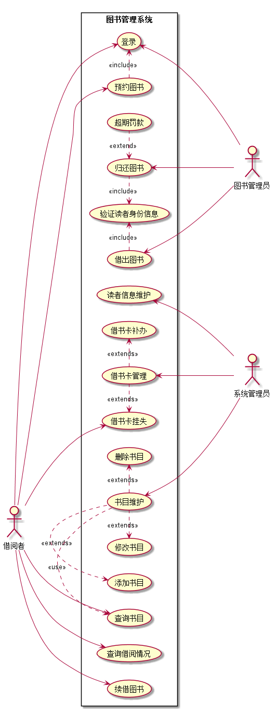
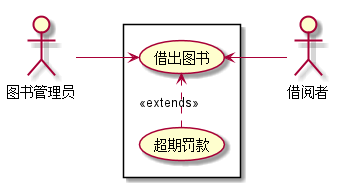

|学号|班级|姓名|
|:-------:|:-------------: | :----------:|
|201510414330|软件(本)15-3|朱亮||

 # 实验二：图书管理系统用例建模
  
 ## 1.图书管理系统的用例关系图
 ### 1.1用例图PlantUML源码如下：
     @startuml
     
     left to right direction
     :系统管理员: as SysAdmin
     :图书管理员: as Admin
     :借阅者: as User
     
     
     rectangle 图书管理系统{
     User --> (登录)
     User --> (查询借阅情况)
     User --> (预约图书)
     (预约图书).>(登录):<<include>>
     User --> (续借图书)
     User --> (查询书目)
     User --> (借书卡挂失)
     
     (借出图书).>(验证读者身份信息):<<include>>
     (借出图书) <-  Admin
     (验证读者身份信息)<.(归还图书):<<include>>
     (归还图书)<.(超期罚款):<<extend>>
     (归还图书) <- Admin
     (登录)<--- Admin
     
     (读者信息维护) <- SysAdmin
     (借书卡管理).>(借书卡补办):<<extends>>
     (借书卡管理) <- SysAdmin
     (借书卡挂失)<.(借书卡管理):<<extends>>
     (书目维护) <--- SysAdmin
     (书目维护).>(删除书目):<<extends>>
     (修改书目)<.(书目维护):<<extends>>
     (添加书目)<.(书目维护):<<extends>>
     (查询书目)<.(书目维护):<<use>>
     }
     
     @enduml
 ### 1.2用例图如下：
 
 
 
## 2. 参与者说明：
### 2.1学生图书管理员
主要职责是：负责帮助教师管理员给来图书馆借还图书的读者进行处理
### 2.2教师图书管理员
主要职责是：负责给读者借还图书进行处理，还要处理图书书目的问题
### 2.3系统管理员
主要职责是：负责图书馆的图书的增删改查，读者用户的增删改查，管理员的增删改查，系统的维护，日志的查看
### 2.4学生
主要职责是：能对图书进行查询，查询自己在图书馆的借书情况，查询欠费书籍的情况，预定和取消预定
### 2.5教师
主要职责是：能对图书进行查询，查询自己在图书馆的借书情况，查询欠费书籍的情况，预定和取消预定，并能查询自己的学生在图书馆的借书情况
## 3.用例规约表
### 3.1“借出图书”用例

|||
|:----:|:-----:|
| 用例名称 | 借出图书 |
| 参与者 | 学生图书管理员（主要参与者），教师图书管理员（主要参与者），学生（次要参与者），教师（次要参与者） |
| 前置条件 | 图书管理员已被识别和授权，该图书未借出 |
| 后置条件 | 存储借书记录，更新库存数量，所借图书状态为借出 |
| 主事件流 | 1.图书管理员将读者借书卡提供给系统；2.系统验证读者身份和借书条件；3.图书管理员将读者所借图书输入系统；4.系统记录借书信息，并且修改图书的状态和此书的可借数量；5系统累加读者的借书数量；6.重复3~5，直到图书管理员确认全部图书登记完毕；7.系统打印借书清单，交易成功完成 |
| 备注 | 图书馆开架借阅，读者找到书后办理借书手续，因此借书不需要验证库存，而且每本书都是可识别的 |