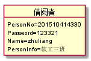
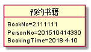
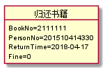

# 实验三：图书管理系统领域对象建模
|        学号      |     班级    |    姓名    |
|:----------------:|:-----------:|:----------:|
|   201510414330   |    软工15-3 |    朱亮   | 
## 1.图书管理系统类图
### 1.1类图PlantUML源码：
```
    @startuml
   class 预约书籍 {
     BookNo
     PersonNo
     BookingTime
   }
   
   class 借出书籍 {
     BookNo
     PersonNo
     LendTime
     LeastTime
   }
   class 归还书籍 {
     BookNo
     PersonNo
     ReturnTime
     Fine
   }
   class 书籍 {
      BookNo
      BookName
      Arthur
      ISBN
      Publish
      price
      BookState
      BookClass
   }
   class 借书卡{
       CardNo
       PersonNo
       LostTag
   }
   class 借书者 {
      PersonNo
      Password
      Name
      PersonInfo
   }
   class 图书管理员{
       AdminID
       Name
       Password
    }
   class 系统管理员 {
      RootId
      Name
      Password
   }
   
   借书者"1" -- "0..*"书籍:查询书籍
   借书者"1" -- "0,1..2"预约书籍:预约
   借书者"1" -- "0,1..2"借出书籍:借阅
   借书者"1" -- "0..*"归还书籍:归还、罚金
   借书者"1" -- "1" 借书卡:借书卡挂失
   借书卡"*"-down-"1"  图书管理员:借书卡补办
   书籍  "*"-down-"1"  图书管理员:增删改查
   借出书籍 "*"-down-"1" 图书管理员:借出书籍、更新书籍
   归还书籍"*"-down-"1"  图书管理员:归还书籍、更新书籍、超期罚金
   预约书籍"*"-down-"1"  图书管理员:查询预约、取消预约
   借书者  "*"-down-"1"  系统管理员:增删改查
   图书管理员 --系统管理员:增删改查
   }
    @enduml
```
### 1.2类图如下：


### 1.3类图说明
类图主要分为预约书籍类，借出书籍类，归还书籍类，书籍类，借书卡类，借书者类，普通管理员类，系统管理员类

## 2.图书管理系统的对象图
### 2.1借阅者类
#### 2.1.1 源码如下：
```
    @startuml
    object 借阅者{
        PersonNo=201510414330
        Password=123321
        Name=zhuliang
        PersonInfo=软工三班
    }
    @enduml
```
#### 2.1.2 对象图如下：


### 2.2 预约对象类
#### 2.1.1 源码如下：
```
    @startuml
    object 预约书籍{
        BookNo=2111111
        PersonNo=201510414330
        BookingTime=2018-4-10
    }
    @enduml
```
#### 2.1.2 对象图如下：


### 2.3 借书对象类
#### 2.1.1 源码如下：
```
    @startuml
    object 借出书籍{
        BookNo=2111111
        PersonNo=201510414330
        LendTime=2018-04-15
        LeastTime=2018-06-15
    }
    @enduml
```
#### 2.1.2 对象图如下：


### 2.4还书对象类
#### 2.1.1 源码如下：
```
    @startuml
    object 归还书籍{
      BookNo=2111111
      PersonNo=201510414330
      ReturnTime=2018-04-17
      Fine=0
    }
    @enduml
```
#### 2.1.2 对象图如下：

