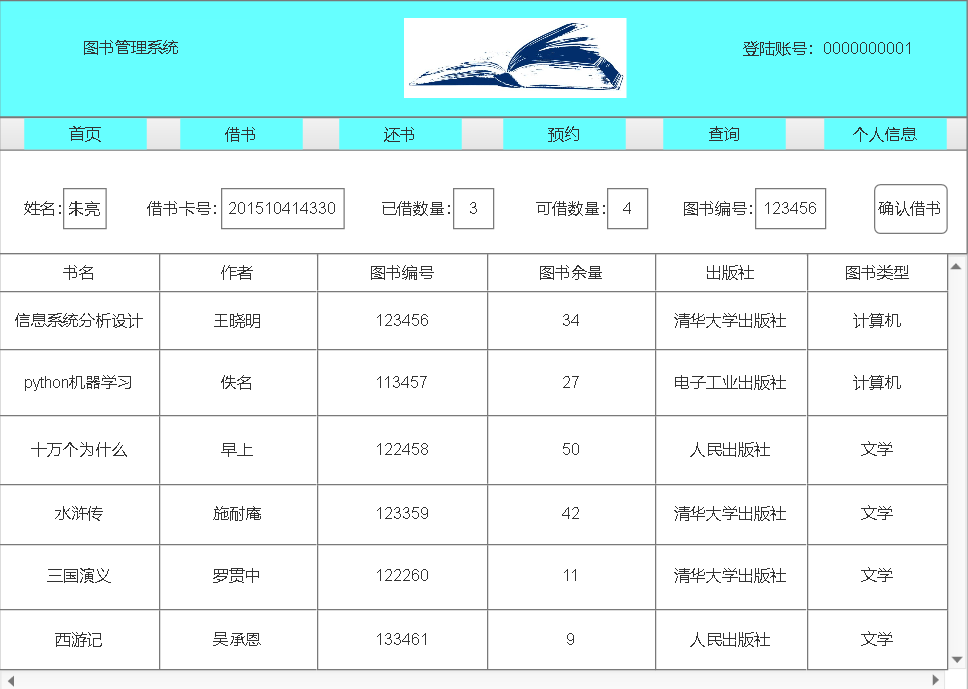

# 实验5 图书管理系统数据库设计与界面设计
|        学号      |     班级    |    姓名    |
|:----------------:|:-----------:|:----------:|
|   201510414330   |    软工15-3 |    朱亮  | 
## 一、数据表设计

#### 1.1 书籍资源（resources）
|    项目   |       字段名       |      类型与宽度     |   是否主键    |   是否允许空值  |  说明 | 
|:-------|:------------- | :----------|:----------|:---------|:-----|
|   资源ID  |     resourceID    |   varchar(13)   |  是      |   否     | 系统管理员分配 |
|   资源名称  |     resourceName    |   varchar(30)   |  否      |   否     |    |
|   国际出版号  |     publishingID    |   varchar(14)   |  否      |   否     |  |
|   价格  |     resourcePrice    |   float   |  否      |   否     |    |
|   简介  |     resourceIntroduction    |   varchar(100)   |  否      |   否     |  超过部分不保存 |
|   书籍数量  |     resourceNumber    |   short   |  否      |   否     |    |
|   可借数量  |     resourceHaveNumber   |   short   |  否      |   否     | 可借数量不可大于馆藏数量 |

#### 1.2 图书书目（books）
|    项目   |       字段名       |      类型与宽度     |   是否主键    |   是否允许空值  |  说明 | 
|:-------|:------------- | :----------|:----------|:---------|:-----|
|   图书编号  |     bookNo    |   varchar(14)   |  是      |   否     | 1-4位：表示藏室号；  5-6位：表示图书类型；7-10位：表示书架号；11-13位表示图书在书架位置；14位为预留位 |
|   作者  |     bookAuthor    |   varchar(30)   |  否      |   否     |  考虑到有些外国作者名字较长，所以预留长度为30  |
|   ISBN编号  |     bookISBNNo    |   varchar(14)   |  否      |   否     |  继承自国际出版号  |
|   出版社  |     bookPublishHouse    |   varchar(20)   |  否      |   否     |    |
|   出版日期  |     bookPublishDate    |   date   |  否      |   否     |    |

#### 1.3 预订记录（reservations）
|    项目   |       字段名       |      类型与宽度     |   是否主键    |   是否允许空值  |  说明 | 
|:-------|:------------- | :----------|:----------|:---------|:-----|
|   记录ID  |     reserveID    |   varchar(15)   |  是      |   否     | 自动增长 |
|   借书卡号  |     userBorrowID    |   varchar(13)   |  否      |   否     |  外键约束：借书者-借书卡号  |
|   资源名称  |     resourceName    |   varchar(30)   |  否      |   否     | 外键约束：馆藏资源-资源名称；预订图书，借书者只需提供图书名称即可，图书名称存储在馆藏资源类中 |
|   预订日期  |     reserveDate    |   date   |  否      |   否     | 当前预订操作的日期，如超过3天没有完成借书操作，则预订失效 |
|   状态  |     reserveStatus    |   bit   |  否      |   否     | 0：失效；1：有效 |

#### 1.4 借书记录（borrowBook）
|    项目   |       字段名       |      类型与宽度     |   是否主键    |   是否允许空值  |  说明 | 
|:-------|:------------- | :----------|:----------|:---------|:-----|
|   记录ID  |     borrowID    |   varchar(15)   |  是      |   否     | 自动增长 |
|   借书卡号  |     userBorrowID    |   varchar(13)   |  否      |   否     |  外键约束：借书者-借书卡号  |
|   图书编号  |     bookNo    |   varchar(14)   |  否      |   否     | 外键约束：图书书目-图书编号；借书需要指定到具体的每本书，注意区分预订的区别 |
|   借书日期  |     borrowDate    |   date   |  否      |   否     | 当前借书操作的日期 |
|   应还日期  |     shouldReturnDate    |   date   |  否      |   否     | 应还日期为借书日期后1月 |
|   续借次数  |     reserveDate    |   date   |  否      |   否     | 根据借书者芝麻分，每次续借时间1个月，最大续借次数为4次。 |

#### 1.5 还书记录（returnBook）
|    项目   |       字段名       |      类型与宽度     |   是否主键    |   是否允许空值  |  说明 | 
|:-------|:------------- | :----------|:----------|:---------|:-----|
|   记录ID  |     returnID    |   varchar(15)   |  是      |   否     | 自动增长 |
|   借书卡号  |     userBorrowID    |   varchar(13)   |  否      |   否     |  外键约束：借书者-借书卡号  |
|   图书编号  |     bookNo    |   varchar(14)   |  否      |   否     | 外键约束：图书书目-图书编号；还书需要指定到具体的每本书，注意区分预订的区别 |
|   实还日期  |     returnDate    |   date   |  否      |   否     | 同一用户同一本书续借超过4个月，则有1个月冷却时间，冷却过后才能再次借该书 |

#### 1.6 逾期记录（overdue）
|    项目   |       字段名       |      类型与宽度     |   是否主键    |   是否允许空值  |  说明 | 
|:-------|:------------- | :----------|:----------|:---------|:-----|
|   记录ID  |     borrowID    |   varchar(15)   |  是      |   否     | 外键约束：借书记录-记录ID |
|   逾期天数  |     overdueDays    |   int   |  否      |   否     |    |
|   罚款金额  |     fineNumber    |   int   |  否      |   否     |  根据逾期天数计算罚款金额，计算方式待定  |
|   状态  |     overdueStatus    |   bit   |  否      |   否     |  1：罚款已交；0：罚款未交  |

#### 1.7 借书者（users）
|    项目   |       字段名       |      类型与宽度     |   是否主键    |   是否允许空值  |  说明 | 
|:-------|:------------- | :----------|:----------|:---------|:-----|
|   借书者ID  |     userID    |   varchar(11)   |  是      |   否     | 自动增长 |
|   姓名  |     userName    |   varchar(30)   |  否      |   否     |    |
|   性别  |     userSex    |   varchar(2)   |  否      |   否     |    |
|   借书卡号  |     userBorrowID    |   varchar(13)   |  否      |   否     |  如同学工号  |
|   图书限额  |     userQuota    |   short   |  否      |   否     |  默认值为5，最大值不可超过10  |
|   已借图书书目  |     userHaveBorrowedBookNum    |   short   |  否      |   否     |   默认为0 |
|   剩余借数量  |     LeftBorrowedBookNum    |   short   |  否      |   否     |  通过最大可借书量减去当前已借书量获得  |

#### 1.8 图书管理员（librarians）
|    项目   |       字段名       |      类型与宽度     |   是否主键    |   是否允许空值  |  说明 | 
|:-------|:------------- | :----------|:----------|:---------|:-----|
|   管理员ID  |     librarianID    |   varchar(11)   |  是      |   否     | 加密保存，系统管理员为每个图书管理员分配唯一的包含字母和数字的管理员ID，管理员通过ID和姓名登录 |
|   姓名  |     librarianName    |   varchar(20)   |  否      |   否     |  加密保存，为了安全，名字可不必为真实名字  |

#### 1.9 系统管理员（administrator）
|    项目   |       字段名       |      类型与宽度     |   是否主键    |   是否允许空值  |  说明 | 
|:-------|:------------- | :----------|:----------|:---------|:-----|
|   管理员ID  |     administratorID    |   varchar(11)   |  是      |   否     | 加密保存，系统管理员自己设定管理员ID，管理员通过ID和姓名登录，如忘记ID，可通过登录数据库修改 |
|   姓名  |     administratorName    |   varchar(20)   |  否      |   否     |  加密保存，为了安全，名字可不必为真实名字   |

## 二、界面设计
#### 2.1 借书界面设计

* 用例图参见：借书用例
* 类图参见：借书类、用户类
* 顺序图参见：借书顺序图
* API接口如下：
##### 1.获取图书信息
* 功能：获取图书信息
* 请求地址：http://app.lib.cn/api/key
* 请求方法：POST
* 请求参数：

|        参数名称      |     必填    |    说明    |
|:----------------:|:-----------:|:----------:|
|   assess_token   |    是   |    用于验证请求合法性的认证信息  | 
|   method         |    是  |     固定为“POST” |
|   version        |    是 |      客户端版本号|
|   key      |    是|      图书信息的关键字|
* 返回实例

        {
            "info": "返回成功",
            "data": {
                "title":"信息系统分析设计",
                "Author":"王晓明",
                "booknum":"123456",
                "publisher":"清华大学出版社",
                "cap":"34",
                "classify":"计算机"
            },
            "code": 200
        }
    
|  参数名称   |   说明   |
|:---:|:----:|
|  info   |  返回信息    |
|  data  |   返回的图书详细信息|
|  code |    返回码 |
